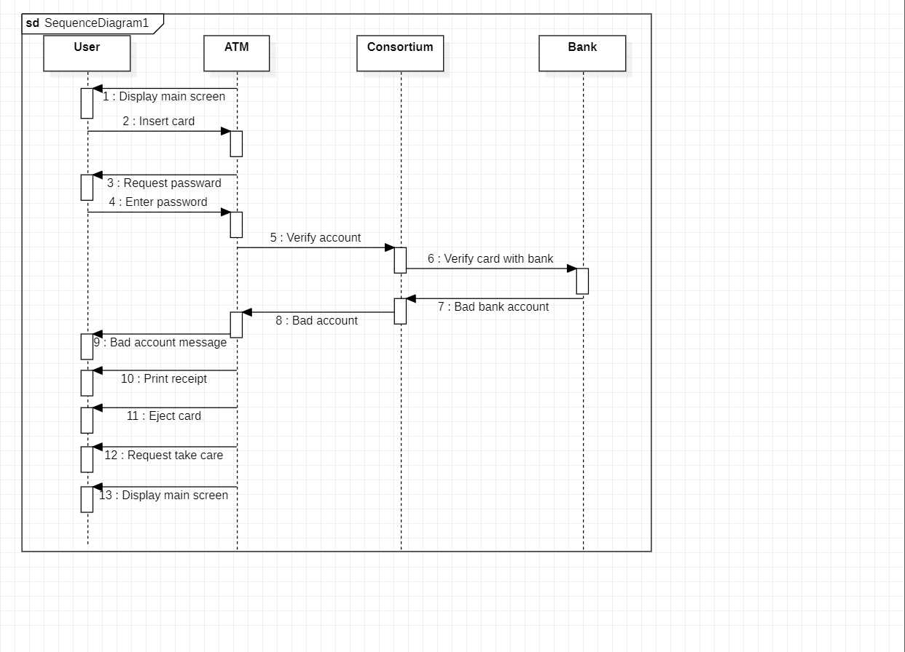

# LAB-1-ATM
## ATM and Banking SYSTEM
### AIM: 

To study the problem statement, SRS document and draw all the UML diagrams of ATM
System.
### PROBLEM STATEMENT:
To create ATM System software that will meet the needs of the applicant and help them
to withdraw money,deposit.

### UML DIAGRAMS:
```PYTHON
DEVELOPED BY : GANESH R
REG NO : 212222240029
```
## USE CASE DIAGRAM:


## SEQUENCE DIAGRAM:


## CLASSDIAGRAM:

## STATECHART DIAGRAM:

## ACTIVITY DAIGRAM:


## COMMUNICATION DIAGRAM:

## PACKAGE DAIGRAM:


### RESULT: 
Thus the Atm and banking System project was executed and the output was verified.
